# 🎣 SOC Lab - Episode 2: Phishing Simulation with Microsoft Defender for Office 365


## 📋 Overview

This project simulates a real-world **credential harvesting phishing attack** against a Microsoft 365 tenant, using **Microsoft Defender for Office 365 (MDO)** to configure threat protection policies, launch a controlled attack simulation, and investigate the resulting telemetry using KQL (Kusto Query Language).

This is Episode 2 of an 8-part SOC Analyst portfolio series. Episode 1 covered endpoint threat simulation with Microsoft Defender for Endpoint (https://github.com/GjcCS/SOC-Lab-MDE-Threat-Simulation). This episode shifts focus to the **email attack surface**, one of the most common initial access vectors in real-world incidents.

**🎯 Goal:** Demonstrate hands-on ability to configure MDO threat policies, design a realistic phishing payload, execute a controlled simulation, and analyze the results the way a SOC Analyst would investigate a real user-reported phishing case.

---

## 🛠️ Lab Environment

| Component | Detail |
|---|---|
| Tenant | Microsoft 365 trial tenant (`contoso.onmicrosoft.com`, a placeholder domain used throughout this documentation) |
| Test users | John Smith (victim), Francisco Steward (display name renamed to "IT Support Team" for an initial manual test) |
| Tools | Microsoft Defender Portal (security.microsoft.com), Attack Simulation Training, Advanced Hunting (KQL) |

---

## 🔐 Phase 1: Threat Policy Configuration

Configured three custom MDO threat policies scoped to the test user population:

### Anti-Phishing Policy (`SOC-Lab-Ep2-AntiPhishing`)
- Spoof detection actions set to **Quarantine** across DMARC quarantine/reject and spoof intelligence detections.
- User impersonation protection enabled and scoped to a protected internal sender.
- Mailbox intelligence and spoof intelligence enabled.
- Quarantine policy: full end-user access, allowing the recipient to review and act on quarantined mail.

### Safe Links Policy (`SOC-Lab-Ep2-SafeLinks`)
- Real-time URL scanning enabled for links clicked in email, including intra-organization mail.
- Click tracking enabled (not disabled) to preserve telemetry for later investigation.
- Custom end-user warning notification configured for flagged links.

### Safe Attachments Policy (`SOC-Lab-Ep2-SafeAttachments`)
- Unknown malware response set to **Block**.
- Quarantine policy configured with the understanding that confirmed-malware detections always require admin release, regardless of configured end-user permissions. This is a deliberate Microsoft safety control worth noting for SOC documentation.


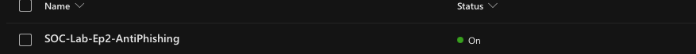

---

## 🧪 Phase 2: Manual Policy Validation (Baseline Test)

Before moving to Microsoft's native simulation tooling, it's good practice to manually validate that newly created policies behave as expected. This was done by renaming a test account's display name to "IT Support Team" and sending a real email, with an urgency-based password-expiration pretext and an embedded link, to the victim account, to confirm the custom Anti-Phishing policy would respond correctly to an impersonation attempt.

**Result:** No detection was triggered in Threat Explorer or the recipient's inbox.

**Why:** This is expected, correct behavior, not a detection gap. Impersonation protection flags a mismatch between a protected identity and the actual sending address (e.g., an external sender using a look-alike address). In this test, the email genuinely originated from the protected account itself; only the display name changed, and SPF/DKIM/DMARC all passed legitimately as intra-tenant mail. There was no identity mismatch for Defender to flag.

💡 This is a useful checkpoint for anyone building a similar lab: confirm your policies behave as designed with a simple manual test first, then move to Attack Simulation Training to explore the full range of pretexts, payloads, and telemetry the platform offers. That's exactly what the next phase does.

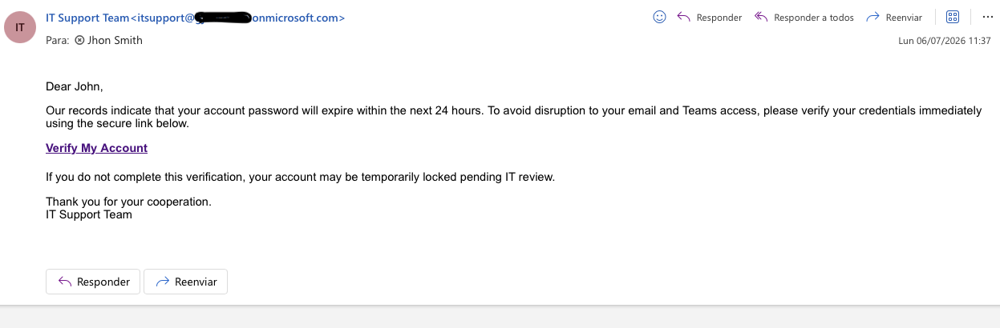

---

## 🎯 Phase 3: Attack Simulation Training

Given the checkpoint above, the investigation moved to **Attack Simulation Training**, Microsoft's native, safely-sandboxed phishing simulation tool that generates authentic detection and reporting telemetry without the authentication artifacts of a manual test.

**Simulation:** `SOC-Lab-Ep2-CredentialHarvest-ITSupport`
**Technique:** Credential Harvest
**Payload:** `ITSupport-PasswordExpiry`

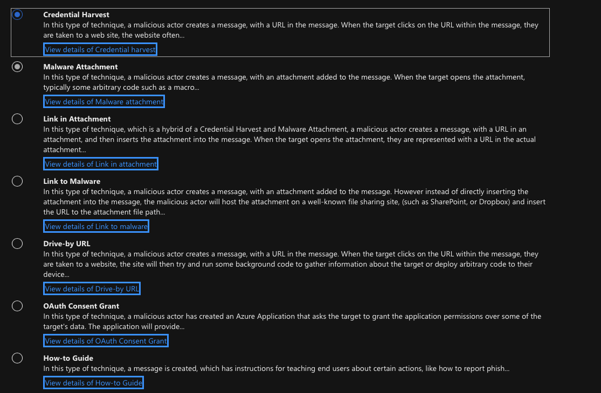

- **Pretext:** Urgent password expiration notice impersonating an internal IT Support team, threatening account lockout to drive quick action.
- **Predicted compromise rate:** 14.11% (Microsoft's model-based estimate for this pretext/technique combination, prior to launch).
- **Login page:** Microsoft-branded simulated sign-in page (Microsoft-hosted simulation domain).
- **Payload indicators configured:** Sense of urgency, threatening language, generic URL hyperlinking, and lack of verifiable sender details, each mapped to the specific phrase in the email that demonstrates the pattern, for use in post-simulation user training.

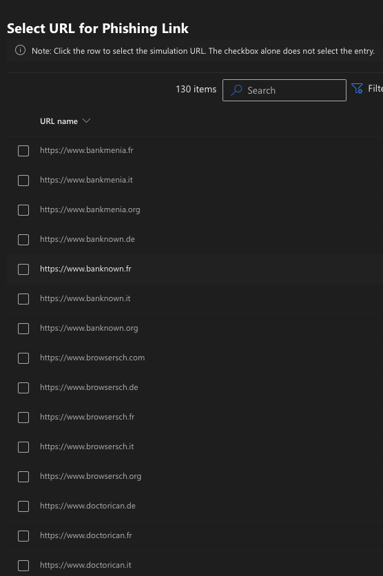

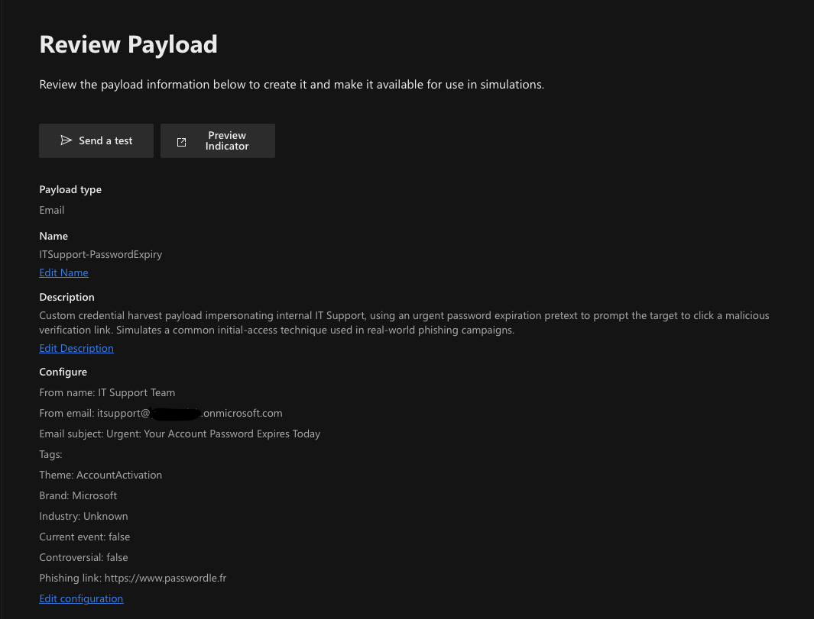

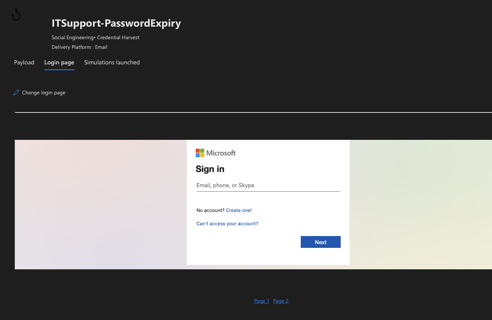

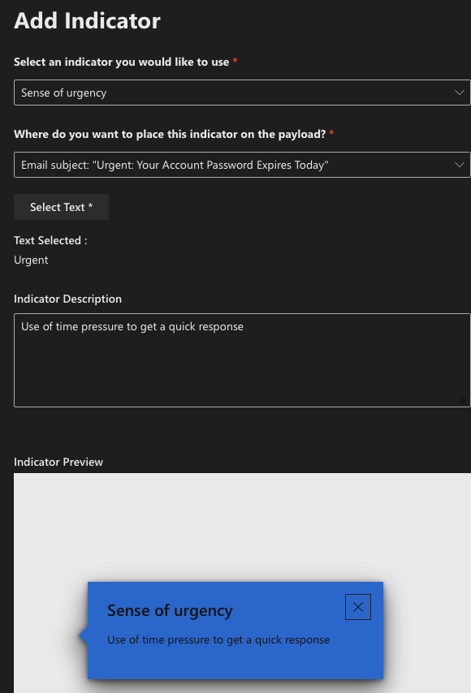

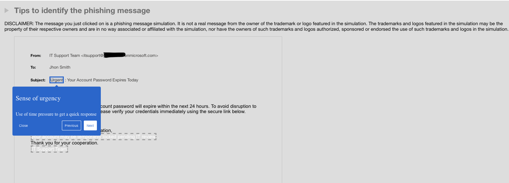

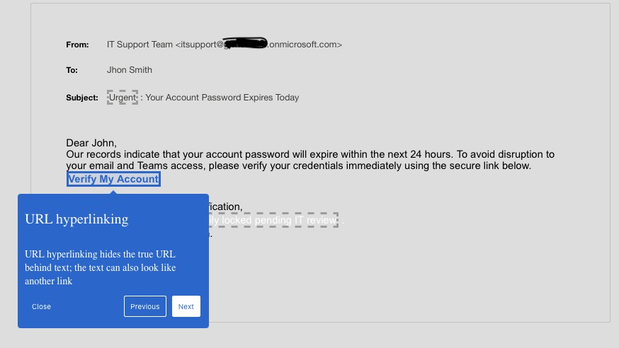

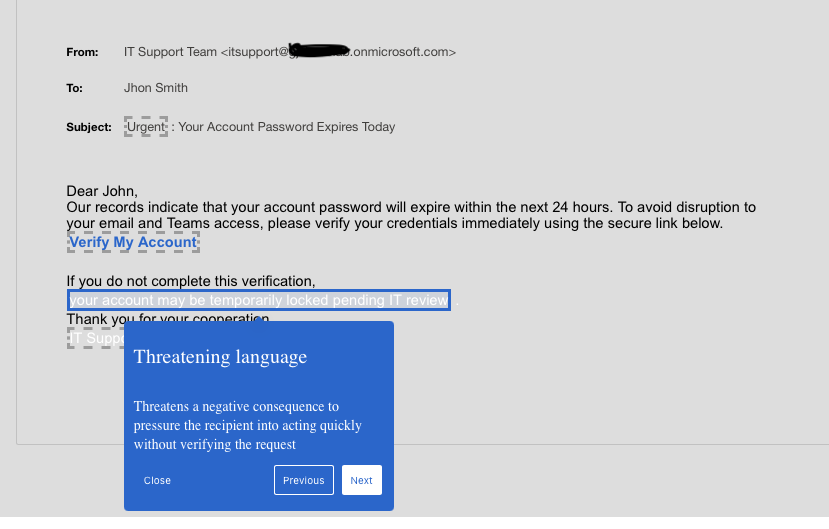

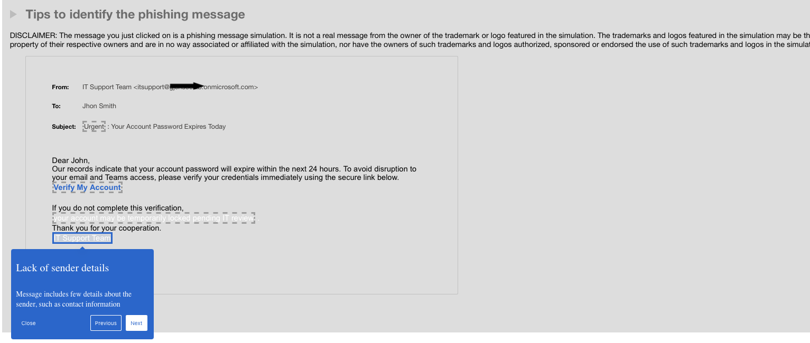

**📊 Simulation outcome:**
1. Target user clicked the embedded link and submitted credentials into the simulated login page (**Compromised**).
2. The user subsequently reported the same message as phishing via the Outlook report action (**Reported**).

This sequence, falling for the initial pretext but self-correcting shortly after, mirrors a realistic end-user response pattern and is a useful data point in SOC awareness reporting: detection isn't only about stopping the click, it's also about how quickly a user recovers and reports.

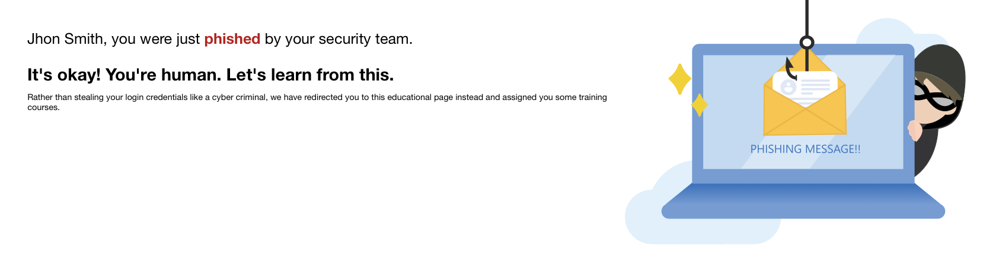

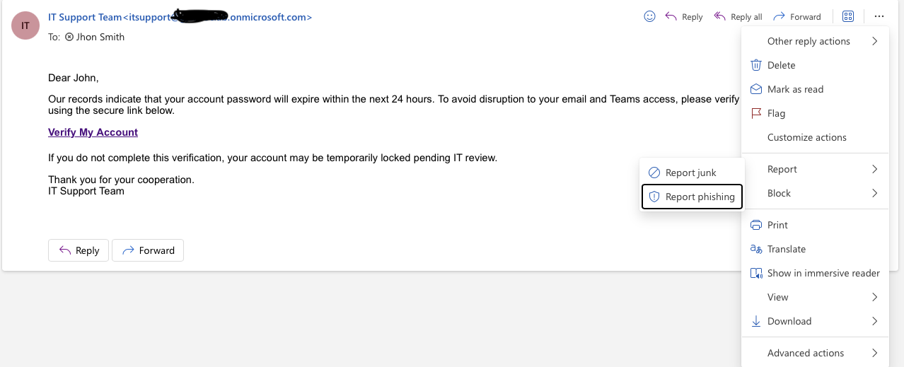

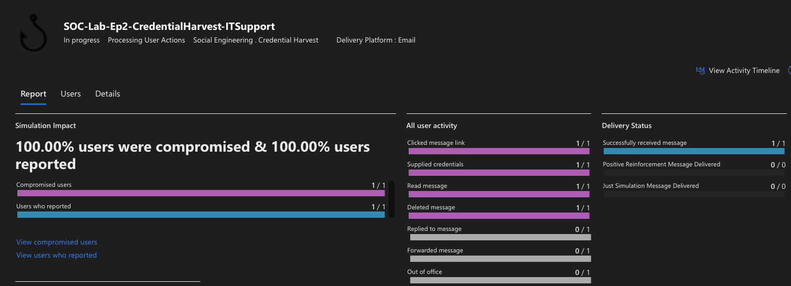

---

## 🔍 Phase 4: Investigation with KQL (Advanced Hunting)

```kql
// Query 1: Confirm delivery and Defender classification of the phishing email
EmailEvents
| where RecipientEmailAddress =~ "JhonSmith@contoso.onmicrosoft.com"
| where Subject has "Password Expires"
| project Timestamp, SenderFromAddress, SenderDisplayName, RecipientEmailAddress, Subject, ThreatTypes, DeliveryAction, DetectionMethods
| order by Timestamp desc
```

**Result:**

| Timestamp | SenderFromAddress | SenderDisplayName | RecipientEmailAddress | Subject | ThreatTypes | DeliveryAction |
|---|---|---|---|---|---|---|
| Jul 6, 2026 10:36:05 AM | fsteward@contoso.onmicrosoft.com | IT Support Team | jhonsmith@contoso.onmicrosoft.com | Urgent: Your Account Password Expires Today | *(empty)* | Delivered |

This result corresponds to the **manual policy validation** from Phase 2, not the Attack Simulation Training payload, and it provides hard telemetry confirming that behavior: `ThreatTypes` is empty and `DeliveryAction` is `Delivered`, meaning Defender passed the message through with no threat classification. This lines up with the Phase 2 methodology: a cosmetic display-name change on a legitimately authenticated sender doesn't trigger impersonation detection, since there's no address-based identity mismatch for Defender to flag. It confirms the policy is working exactly as designed before moving on to Attack Simulation Training.

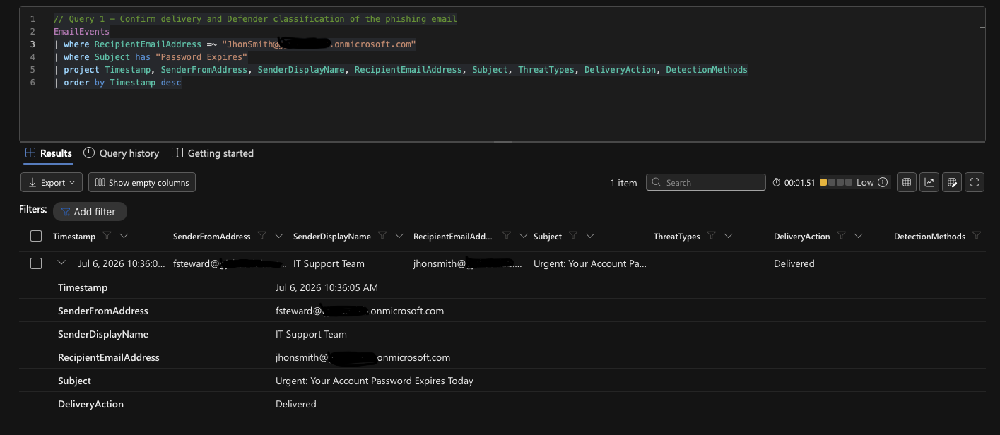

```kql
// Query 2: Attempt to confirm the malicious link click via Safe Links telemetry
UrlClickEvents
| where AccountUpn =~ "JhonSmith@contoso.onmicrosoft.com"
| where Timestamp > ago(2d)
| project Timestamp, AccountUpn, Url, ActionType, IsClickedThrough, ThreatTypes
| order by Timestamp desc
```

**Result:** No rows returned.

**Why:** The Attack Simulation Training click (on the Microsoft-hosted simulation domain, `passwordle.fr`) is tracked through Attack Simulation Training's own reporting subsystem, visible in the simulation dashboard as "Compromised," rather than through the standard `UrlClickEvents` schema, which is populated by Safe Links interception of real production mail traffic. These are two distinct telemetry paths within Defender for Office 365: one measures simulated training outcomes, the other measures real-world Safe Links enforcement. Recognizing which telemetry source answers which question is itself part of the investigation. Not every "no results" query is a dead end.

---

## 🗺️ MITRE ATT&CK Mapping

| Tactic | Technique | ID |
|---|---|---|
| Initial Access | Phishing: Spearphishing Link | T1566.002 |
| Credential Access | Input Capture (credential harvesting via fake login page) | T1056.003 |
| Defense Evasion (attacker perspective) | Impersonation | T1656 |

---

## 💡 Key Takeaways

- Display-name spoofing and true address-based impersonation trigger different detection logic in MDO. Testing controls requires understanding *which* threat model a given feature is designed to catch.
- Attack Simulation Training provides safe, realistic telemetry that manual testing cannot replicate without deliberately misconfiguring authentication, making it the correct tool for this class of exercise.
- A "successful" phish (click + credential entry) is not necessarily the end of the story. User self-reporting after the fact is a meaningful secondary signal for measuring security awareness culture.

---

## ⚠️ Disclaimer

All attack simulations in this lab were performed in a **controlled, isolated environment** owned and managed by the author. No production systems, networks, or third-party infrastructure were involved. This project is intended solely for educational purposes and cybersecurity skill development.

---

## 👤 Author

**Guillermo Costa**

[](https://www.linkedin.com/in/guillermo-costa)
[](https://github.com/GjcCS)
